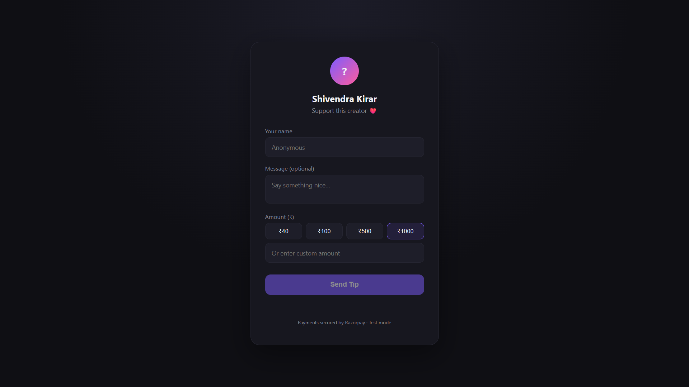
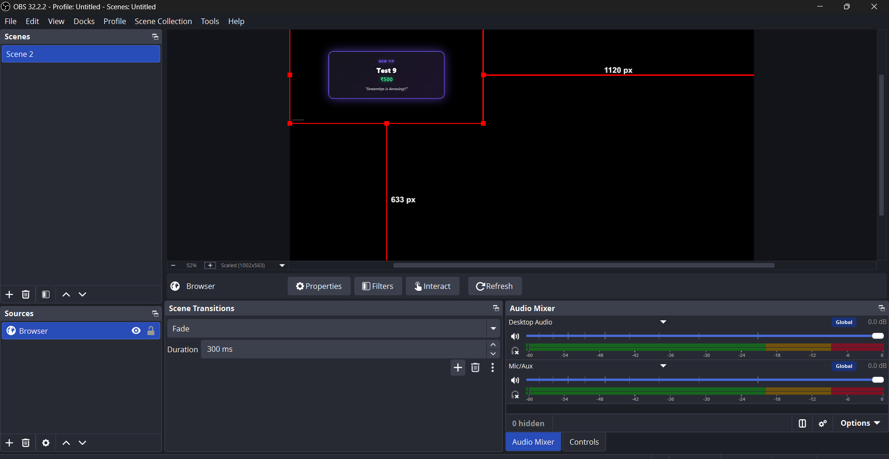

# StreamTips

Real-time tipping platform for livestreamers. A viewer pays via Razorpay; once payment is confirmed by a signature-verified webhook, an alert renders live inside the creator's OBS stream.

## Demo

Tip page and live OBS overlay, side by side:

<p float="left">
  
  
</p>

## Architecture

```text
Viewer
  │
  │ POST /tips
  ▼
FastAPI ───────────────► Razorpay
  │                         │
  │ tip: pending             │ payment.captured
  │                         ▼
  │ ◄──────────── signed webhook (raw body + HMAC-SHA256)
  │
  ├── verify signature
  ├── insert event_id (unique constraint → idempotency)
  ├── tip: pending → success
  │
  └──────── WebSocket ─────► OBS Browser Source
                              (subscribed via overlay_token)
```

**Design constraint:** the client can initiate a payment but cannot declare it successful. `POST /tips` only ever writes a `pending` row. The `pending → success` transition happens in exactly one place — the webhook handler, after signature verification — so there is no client-reachable path to fabricate a paid tip.

## Stack

| Layer | Choice |
|---|---|
| API | FastAPI, Pydantic |
| Database | PostgreSQL, SQLAlchemy, Alembic |
| Auth | JWT, bcrypt |
| Payments | Razorpay Orders API + HMAC-SHA256 webhook verification |
| Real-time | Native WebSockets (single-process, in-memory connection registry) |
| Overlay | HTML/CSS/JS served as an OBS Browser Source |

## API surface

| Method | Path | Auth | Purpose |
|---|---|---|---|
| POST | `/auth/signup` | — | Create creator account, returns JWT |
| POST | `/auth/login` | — | Issue JWT |
| GET / PATCH | `/users/me` | JWT | Read/update own profile |
| GET | `/users/me/overlay` | JWT | Fetch private `overlay_token` |
| GET | `/creators/{username}` | — | Public creator lookup (tip page) |
| POST | `/tips` | — | Create Razorpay order + `pending` tip |
| POST | `/webhooks/razorpay` | signature | Verify payment, flip tip to `success`, broadcast |
| WS | `/ws/overlay/{overlay_token}` | token | OBS overlay subscribes to tip events |

## Security

| Risk | Mitigation |
|---|---|
| Client-forged payment success | Only the webhook handler can set `status = success`; verified via HMAC-SHA256 against the raw request body |
| Duplicate webhook delivery | Unique constraint on `webhook_events.event_id` — a second insert fails at the database level, not just in application logic |
| Overlay URL guessing | 64-character random `overlay_token`, independent of username/id, validated before the WebSocket connection is accepted |
| XSS via tip message | Viewer-submitted `payer_name` / `message` are HTML-escaped before being rendered in the overlay |
| Login user enumeration | Identical error/status for unknown email vs. wrong password |
| OBS disconnect mid-stream | Overlay retries the WebSocket connection on a fixed delay, no manual refresh required |

Idempotency, signature verification, reconnection, and the forged-payment path have each been manually tested, including duplicate webhook resends and concurrent tip submissions.

## Setup

```bash
python3 -m venv venv
source venv/bin/activate
pip install -r requirements.txt

cp .env.example .env
# set DATABASE_URL, JWT_SECRET_KEY, RAZORPAY_KEY_ID, RAZORPAY_KEY_SECRET

# CREATE DATABASE streamtips;  (in psql)
alembic upgrade head

uvicorn app.main:app --reload
```

API docs: `http://localhost:8000/docs`

### End-to-end test

1. `POST /auth/signup` via `/docs` to create a creator.
2. Open `frontend/tip.html?creator=<username>`, submit a tip using [Razorpay's test card numbers](https://razorpay.com/docs/payments/payments/test-card-upi-details/).
3. Razorpay cannot reach `localhost` directly — tunnel with `ngrok http 8000` and register `https://<ngrok-url>/webhooks/razorpay` under Razorpay Dashboard → Webhooks (event: `payment.captured`).
4. Fetch `overlay_token` from `GET /users/me/overlay`, open `frontend/overlay.html?token=<token>` as an OBS Browser Source, and confirm the alert renders when the webhook is processed.

## Scope

**Implemented:** JWT auth, creator profiles, Razorpay order creation, webhook verification + idempotency, WebSocket delivery, OBS overlay with reconnection.

**Deliberately excluded:** Redis (no multi-instance WebSocket fan-out required at current scale — see comments in `app/services/connection_manager.py`), TTS, leaderboards, donation goals, custom themes, third-party stream-platform integrations, cloud deployment.

## Project structure

```
app/
├── core/         # config, database session, JWT/password hashing, auth dependency
├── models/       # users, tips, webhook_events
├── schemas/      # Pydantic request/response models
├── routers/      # auth, users, public, tips, webhooks, websocket
└── services/     # Razorpay client, WebSocket connection manager
frontend/
├── tip.html      # viewer-facing tip page
├── overlay.html  # OBS Browser Source overlay
└── ws_test.html  # plain-text WebSocket debug page
```
